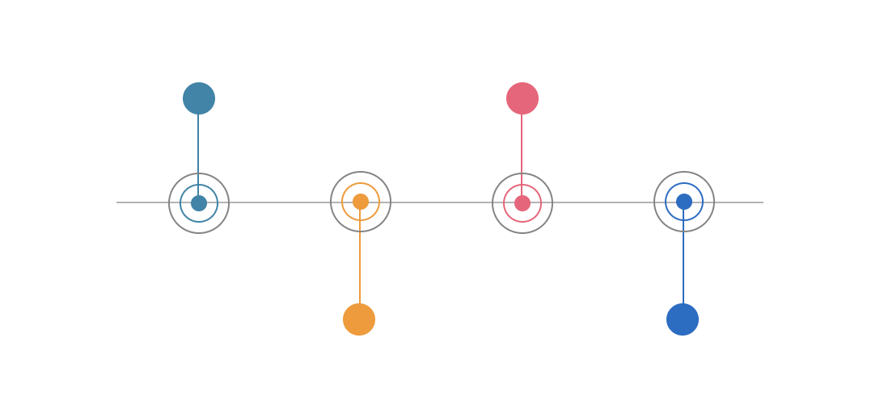

<div align="center">
  
  <h1>Vue Next Timeline</h1>
</div>

> A simple component to display a __timeline in horizontal__ format with __Vue3__.

## Status

[](https://github.com/cristianpoleyJS/vue-next-timeline/)
[](http://standardjs.com/)
[](https://github.com/cristianpoleyJS/vue-next-timeline/)

## How to install

### npm

```bash
npm install vue-next-timeline --save
```

## Quick start

### Vue.js

You can import in your `main.js` file

#### Globally
```js
import { createApp } from 'vue'
import VueNextTimeline from "vue-next-timeline"

// Create Vue instance
const app = createApp(App)

// Register Button component globally
app.component(VueNextTimeline)
```

#### Locally in any component

```js
import { VueNextTimeline } from "vue-next-timeline";

export default {
  components: {
    VueNextTimeline
  }
};
```

## Basic usage

```html
<template>
  <vue-next-timeline :items="items" />
</template>

<script>
  export default {
    data() {
      const item1 =  {
        title: '2013',
        content: 'The international year of mathematics on planet Earth. The international year of mathematics on planet Earth',
        color: '#2785ab'
      };
      const item2 = {
        title: '2014',
        content: 'International Year of Family Farming',
        color: '#f89714'
      };
      const item3 = {
        title: '2015',
        content: 'International Year of Light and Light-Based Technologies',
        color: '#f65b78'
      };
      const items = [item1, item2, item3];

      return { items };
    }
  };
</script>
```

## Props

| Property name       |    Type |  Default  | Description                                                                                    |
| ------------------------------ | ---------- | --------- | -------------------------------------------------------- |
| items                         |   Array |   []    | Array of objects to be displayed. Must have at least a content property
| item-unique-key         |   String |   null        | Key with unique value of each item in the array. Used for the v-for Key |
| item-title-key               |   String |   'title'    | Key to display the item title                       |
| item-content-key               |   String |   'content'    | Key to display the contents of the item                    |
| item-clickable       | Boolean |    true     | Indicates if the title or content can be clicked to launch a $emit event with the clicked element |
| min-width       | String |    '700px'     | Minimum width of the upper div of the component |
| max-width       | String |    '1220px'     | Maximum width of the upper div of the component |
| min-width-item       | String |    '200px'     | Minimum width of each item |
| max-width-item       | String |    '400px'     | Maximum width of each item |
| text-align       | String |   'center'     | Alignment of item content and title |
| class-name       | String |   ''     | Class to be used for custom styles |

## Development

[](https://github.com/guastallaigor/vue-next-timeline/issues)

> **Note**: Contributions are very welcomed, however is very important to open a new issue using the issue template **before** you start working on anything, so we can discuss it before hand

Fork the project and enter this commands in your terminal

```sh
git clone https://github.com/cristianpoleyJS/vue-next-timeline.git
cd vue-next-timeline
npm install
npm run serve
```

### Commitlint

This project follows the [commitlint](https://github.com/conventional-changelog/commitlint) guidelines, with minor changes.

## Contributing

<a href="https://www.buymeacoffee.com/cristianpoley" target="_blank"></a>

## License

MIT © [cristianpoleyJS](https://github.com/cristianpoleyJS/vue-next-timeline/blob/master/LICENSE)
